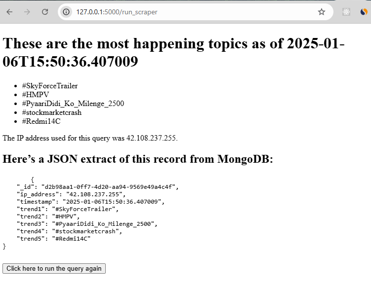

# Twitter Trending Topics Scraper

A Python script that scrapes Twitter's trending topics using proxies, stores the data in MongoDB, and generates an HTML report.

[Link Text](https://youtu.be/hlxL9rRpEh4)

## Features

- Scrapes top trending topics from Twitter
- Uses proxy rotation for reliable data collection
- Stores results in MongoDB for historical tracking
- Generates an interactive HTML report
- Supports automatic re-running via web interface

## Prerequisites

- Python 3.8+
- MongoDB database
- ProxyMesh account or similar proxy service
- Twitter account

## Output

The HTML report includes:
- Top 5 trending topics
- Current proxy IP address
- MongoDB record details
- Option to re-run the scraper



## Installation

1. Clone the repository:
```bash
git clone https://github.com/yourusername/twitter-trending-scraper.git
cd twitter-trending-scraper
```

2. Install required dependencies:
```bash
pip install -r requirements.txt
```

## Configuration

### MongoDB Setup
Configure your MongoDB connection in the script:
```python
MONGO_URI = "mongodb+srv://your-connection-string"
```

### Proxy Configuration
Update the proxy settings:
```python
PROXY_HOST = "your.proxy.host"
PROXY_PORT = your_proxy_port
PROXY_USERNAME = "your_proxy_username"
PROXY_PASSWORD = "your_proxy_password"
```

### Twitter Credentials
Set your Twitter credentials as environment variables:
```bash
export TWITTER_USERNAME="your_username"
export TWITTER_PASSWORD="your_password"
```

## Usage

Run the script:
```bash
python selenium_script.py
```

The script will:
1. Connect to Twitter using the configured proxy
2. Fetch current trending topics
3. Store the data in MongoDB
4. Generate an HTML report


## License

This project is licensed under the MIT License - see the [LICENSE.md](LICENSE.md) file for details.

## Disclaimer

This tool is for educational purposes only. Ensure you comply with Twitter's Terms of Service and rate limiting policies when using this scraper.
